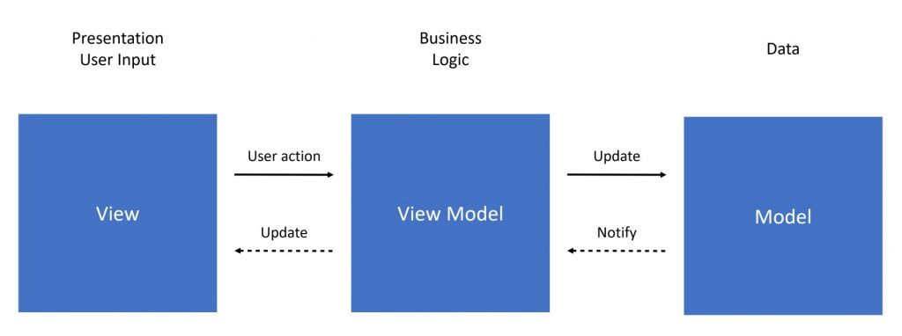

# Swift MVVM

Projeto destinado para a palestra sobre MVVM apresentado no workshop da Digital Innovation One (DIO) em parceria com a GFT no dia 24/07/2021.

## Arquitetura

<small>Imagem retirada de <a href="https://quickbirdstudios.com/blog/app-architecture-our-functional-mvvm-approach-with-rx/">https://quickbirdstudios.com/blog/app-architecture-our-functional-mvvm-approach-with-rx/</a></small>

### Explicação

A camada **View** trata apenas da apresentação das informações na tela e captura os gestos do usuário. Toda informação apresentada na tela vem da **ViewModel** assim como o tratamento das ações do usuário.

A camada **ViewModel** é responsável por tratar da parte lógica da aplicação, ou seja, chamada de requests, tratamento de informações para enviar para a **View** entre outras partes lógicas da aplicação.

A camada de **Model** é responsável pela definição dos modelos da aplicação, ou seja, a representação dos dados para ser utilizada nas outras camadas e funções específicas desse modelo.